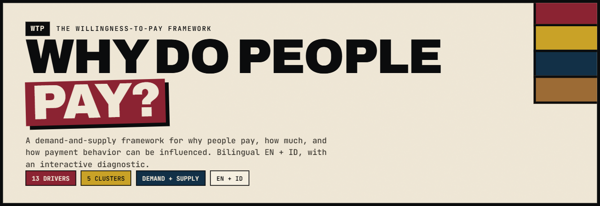
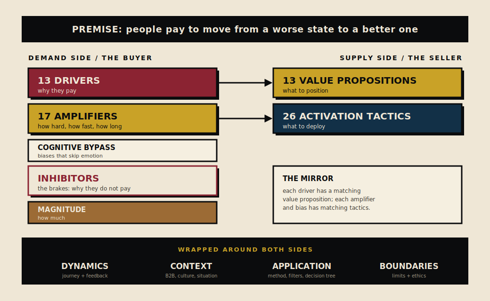

# The Willingness-to-Pay Framework

**A demand-and-supply architecture for understanding why people pay, how much they pay, and how payment behavior can be influenced.**

Most frameworks for buyer psychology either list emotions with no structure, or stop at one side of the transaction. This one maps both sides: thirteen reasons a buyer pays, the brakes that stop them, how much they will pay, and the matching moves a seller makes. It comes from strategic-communications and marketing practice in Indonesia, and it is validated against more than ninety sources in consumer psychology and behavioral economics.

It is honest about its reach. It explains payment after the fact better than it forecasts payment beforehand, and it states exactly where it can be proven wrong and where it must not be used.

## What is inside

- **The framework**, in full, in two languages:
  - English: [`framework/wtp-framework.en.md`](framework/wtp-framework.en.md)
  - Bahasa Indonesia: [`framework/wtp-framework.id.md`](framework/wtp-framework.id.md)
- **An interactive diagnostic** that runs the framework's decision tree in your browser. Open `index.html`, or use the live version via GitHub Pages.
- **Worked examples** that apply the framework end to end: [`examples/`](examples/)
- **The source list**, every citation behind the framework: [`framework/sources.md`](framework/sources.md)

## The architecture in one screen

## How to use it

Three entry points, depending on how much time you have.

1. **Fifteen minutes.** Open the [interactive diagnostic](index.html). Answer the steps. Read the diagnosis: primary driver, positioning, first tactics, the brakes to clear, the magnitude reminder, and the ethical check.
2. **An afternoon.** Read Part V of the framework, the application toolkit. Run a real product through the diagnostic method (section 16), the four product filters (section 17), and the proposal questions (section 18).
3. **A deep read.** Read the framework front to back. Start on the demand side, move to the supply mirror, then add dynamics and context. Finish with the boundaries so you know its limits before you rely on it.

## A worked sentence

A small business pays Rp 149 thousand a month for a messaging assistant. The primary driver is **Solve** (orders are being lost to unanswered messages). The positioning is **Remedy** ("no more missed messages"). The first tactics are outcome visualization and risk reversal. The brake to clear is the **trust deficit** (will it really work for my shop?), answered with a free trial and visible proof. The magnitude is anchored against the cost of the lost orders, not against the software's price. That is the whole framework in one transaction.

## The ethics

The framework maps psychological vulnerabilities and the levers that move them. The same map can inform a choice or exploit it. Before deploying any combination, apply the **Consumer Autonomy Test**: would this person still buy if they fully understood how they were being influenced? If probably not, it has crossed into manipulation. Part VI lists the red-zone combinations to avoid.

## License

This repository is dual-licensed. The interactive tool's code (the files in `/assets` and `index.html`) is under the [MIT License](LICENSE). The framework text (the documents in `/framework` and `/examples`, and the framework prose here) is under [Creative Commons Attribution 4.0 International](LICENSE-CONTENT), CC BY 4.0. You may use, share, and adapt both, including commercially. For the framework text, give credit to Dharmawan.

## Contributing

Corrections, translations, worked examples, and challenges to the claims are all welcome. See [`CONTRIBUTING.md`](CONTRIBUTING.md). The framework is strongest when its claims are tested, so a well-argued disagreement is a contribution.

## Citing this

If you use the framework in published work, see [`CITATION.cff`](CITATION.cff), or cite it as: Dharmawan (2026), *The Willingness-to-Pay Framework*, version 5.0.

---

# Kerangka Willingness-to-Pay (Bahasa Indonesia)

**Arsitektur sisi permintaan dan sisi penawaran untuk memahami mengapa orang membayar, berapa besar, dan bagaimana perilaku membayar dapat dipengaruhi.**

Sebagian besar kerangka psikologi pembeli hanya mendaftar emosi tanpa struktur, atau berhenti di satu sisi transaksi. Kerangka ini memetakan dua sisi: tiga belas alasan pembeli membayar, rem yang menghentikan mereka, berapa besar yang akan mereka bayar, dan langkah penjual yang berpasangan. Ia lahir dari praktik komunikasi strategis dan pemasaran di Indonesia, dan divalidasi terhadap lebih dari sembilan puluh sumber.

Ia jujur soal jangkauannya. Ia lebih baik menjelaskan pembayaran setelah terjadi daripada meramalkannya, dan ia menyatakan persis di mana ia bisa dibuktikan salah dan di mana ia tidak boleh dipakai.

## Isi repositori

- **Kerangka lengkap**, dua bahasa: [`framework/wtp-framework.id.md`](framework/wtp-framework.id.md) dan [`framework/wtp-framework.en.md`](framework/wtp-framework.en.md)
- **Diagnostik interaktif** yang menjalankan pohon keputusan kerangka di peramban. Buka `index.html`, atau pakai versi langsung via GitHub Pages.
- **Contoh terapan** dari ujung ke ujung: [`examples/`](examples/)
- **Daftar sumber**: [`framework/sources.md`](framework/sources.md)

## Cara memakai

1. **Lima belas menit.** Buka diagnostik interaktif, jawab langkahnya, baca diagnosisnya.
2. **Satu sore.** Baca Bagian V (perangkat aplikasi). Jalankan satu produk nyata lewat metode diagnostik, empat saringan produk, dan pertanyaan proposal.
3. **Bacaan mendalam.** Baca kerangka dari depan ke belakang, lalu Bagian VI untuk tahu batasnya sebelum bergantung padanya.

## Etika

Kerangka ini memetakan kerentanan psikologis dan tuas yang menggerakkannya. Sebelum mengerahkan kombinasi apa pun, terapkan Uji Otonomi Konsumen: apakah orang ini tetap membeli kalau ia sepenuhnya paham bagaimana ia dipengaruhi? Kalau kemungkinan tidak, ia telah menyeberang ke manipulasi.

## Lisensi

Repositori ini berlisensi ganda. Kode tool (berkas di `/assets` dan `index.html`) memakai [Lisensi MIT](LICENSE). Teks framework (dokumen di `/framework` dan `/examples`) memakai [Creative Commons Attribution 4.0 International](LICENSE-CONTENT), CC BY 4.0. Boleh dipakai, dibagikan, dan diadaptasi, termasuk untuk komersial. Untuk teks framework, sertakan kredit ke Dharmawan.
